# lab03py

## Menentukan Nilai Terbesar dari dua angka Menggunakan stastment if.
- Berikut ini adalah Syntax Codenya:
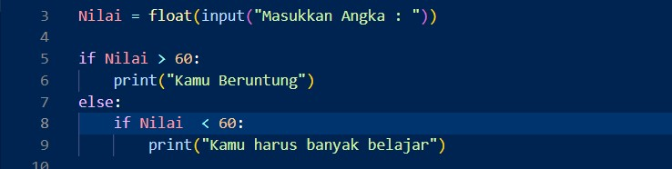
  Maka ini adalah hasilnya:
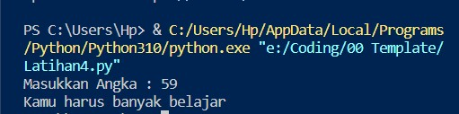

## Menghitung Nilai dari yang terkecil hingga terbesar
- Berikut ini adalah syntax codenya:
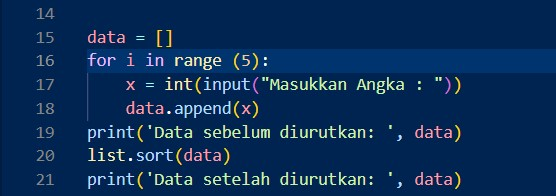
- Dan ini adalah hasil print tersebut:
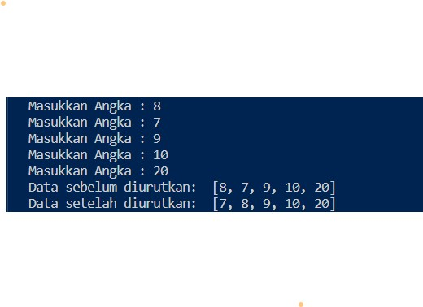

## Perogram perulangan bertingkat nested
- Berikut ini adalah syntax codenya:
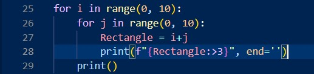
- Ini adalah hasilnya:
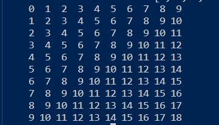

## Menghitung bilangan Random 
- Berikut ini adalah syntax codenya:
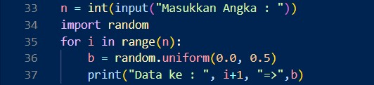
-Berikut ini adalah hasil dari printnya:
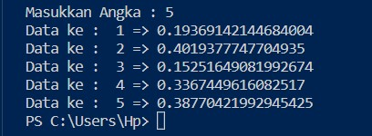

## Menentukan Nilai terbesar dari 3 bilangan
- Berikut ini adalah syntax codenya:
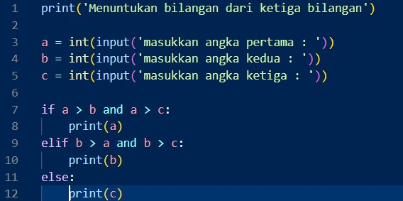
- Dan ini adalah hasinya:
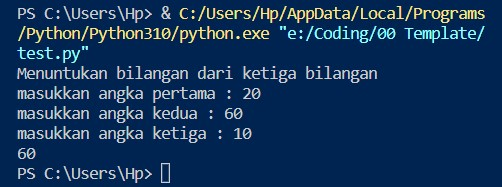

## Menampilkan bilangan terbesar dari n buah data yang diinputkan, dan berakhir dengan menuliskan "0"
- Berikut ini adalah syntax codenya:
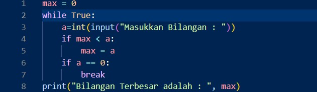
- Dan ini adalah hasil running nya:
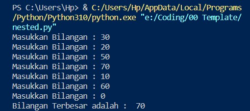

## Menghitung laba
- Seorang pengusaha menginvestasikan uangnya untuk memulai usahanya dengan modal awal 100 juta, pada bulan pertama dan kedua belum mendapatkan laba. pada bulan ketiga baru mulai mendapatkan laba sebesar 1% dan pada bulan ke 5, pendapatan meningkat 5%, selanjutnya pada bulan ke 8 mengalami penurunan keuntungan sebesar 2%, sehingga laba menjadi 3%.
- dan ini adalah syntax codenya:
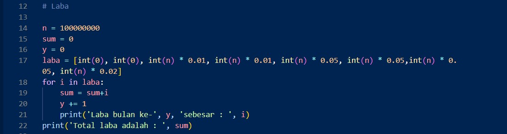
- total keuntungan selama 8 bulan berjalan usahanya.
- Berikut ini adalah runningnya:
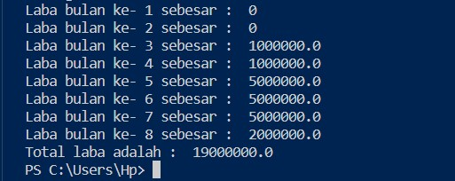

### Sekian Dan Thaks A lot 